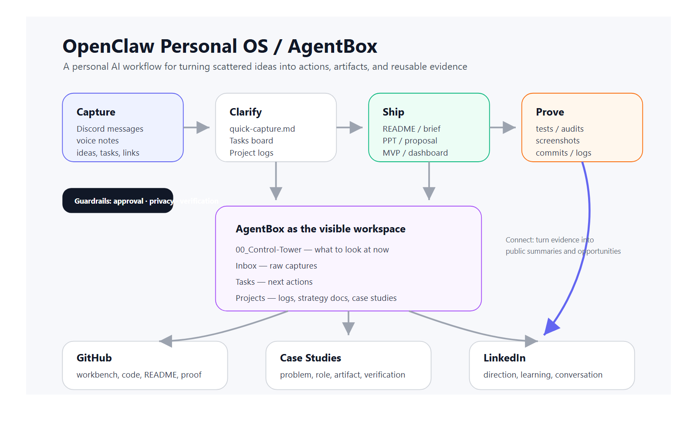
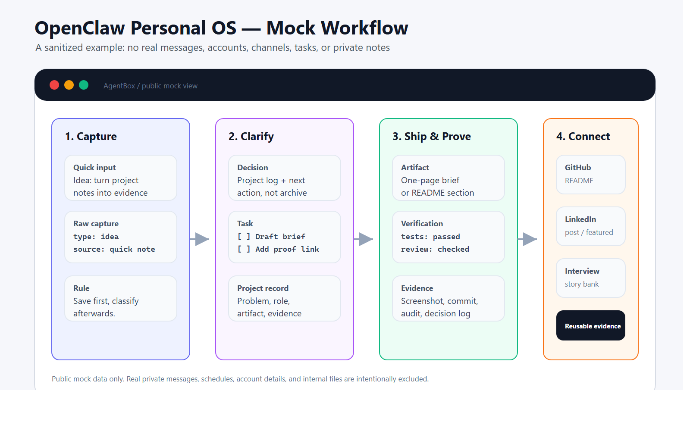

# OpenClaw Personal OS / AgentBox

> A personal AI workflow experiment for turning scattered ideas into tasks, artifacts, and reviewable project records.



## Summary

**KR**  
OpenClaw Personal OS / AgentBox는 흩어지는 아이디어와 작업을 `Capture → Clarify → Ship → Prove → Connect` 루프로 연결해, 기록이 실제 실행, 검토 가능한 산출물, 포트폴리오 자료로 이어지게 만드는 개인 AI workflow 실험입니다.

**EN**  
OpenClaw Personal OS / AgentBox is a personal AI workflow experiment that turns scattered ideas and tasks into actions, artifacts, and reviewable project records through a `Capture → Clarify → Ship → Prove → Connect` loop.

## Problem

Ideas, tasks, and project notes appear constantly, but they often get scattered across chats, notes, browser tabs, and temporary files.

The problem is not just “not writing things down.” The bigger problem is that this chain often breaks:

```text
thought → task → artifact → verification → reviewable record
```

A note can be captured but never revisited. A project can be completed without evidence that explains what was done. AI-generated output can look useful but disappear after one conversation.

So the question behind this experiment is:

> Can an AI agent be used not just as a response tool, but as a workflow layer for capturing, clarifying, shipping, proving, and connecting work?

## My Role

I worked on this as the user, designer, and PM of the workflow.

Main responsibilities:

- Defined bottlenecks in my personal project and learning workflow
- Designed a simple AgentBox folder structure
- Separated quick captures, tasks, project logs, and portfolio evidence
- Used OpenClaw to support reminders, documentation, drafting, and review
- Designed a confirmation gate for public/external actions
- Connected the workflow to GitHub, LinkedIn, case studies, and interview-ready project records

The goal was not to make AI “do everything automatically.”  
The goal was to make AI-assisted work easier to review, verify, recover, and reuse.

## System Design

The core loop is:

```text
Capture → Clarify → Ship → Prove → Connect
```

| Step | Meaning | Example artifact |
|---|---|---|
| Capture | Quickly save ideas, tasks, questions, and notes | quick-capture note |
| Clarify | Decide whether it is a task, memory, project log, or future artifact | task board / project log |
| Ship | Turn it into a small artifact | README, brief, proposal, MVP, dashboard |
| Prove | Leave verification records | test result, screenshot, audit, commit, log |
| Connect | Reuse it for public/profile/career contexts | GitHub README, LinkedIn post, case study, interview answer |

AgentBox acts as the visible workspace:

```text
AgentBox
├─ 00_Control-Tower
├─ Inbox
├─ Tasks
├─ Projects
├─ outbox
└─ archive / scratch
```

## Mock Workflow

The image below uses only sanitized mock data. It does not contain real private messages, account details, schedules, or internal files.



Example flow:

```text
quick input
→ classify as project log + next action
→ draft a small artifact
→ verify with a screenshot, test, audit, or review
→ reuse as GitHub, LinkedIn, or interview-ready project records
```

## Before / After

| Before | After |
|---|---|
| Ideas scattered across chats and tabs | Captured into a visible workflow |
| Tasks relied on memory | Tasks and project logs become reviewable |
| Project records were reconstructed later | Reviewable records are collected during the work |
| AI output ended as one-off text | Outputs are inspected, revised, and saved |
| GitHub/LinkedIn updates felt separate | Work artifacts become profile-ready project records |

## Guardrails

The most important part of this workflow is not automation. It is safe, reviewable operation.

Guardrails:

- Public posts, LinkedIn edits, GitHub pushes/releases, comments, and DMs require final human confirmation
- Private messages, account details, channel IDs, personal schedules, and sensitive notes are excluded from public materials
- Ongoing projects are not presented as finished outcomes
- AI-generated artifacts should be checked through tests, screenshots, audits, diffs, or direct inspection when possible
- Deletions require explicit approval

## What I Learned

The value of an AI-assisted workflow is less about how autonomous the AI is and more about whether the work can be reviewed, trusted, and reused.

The important questions are:

- Does the work leave a trail?
- Can I tell what changed and why?
- Is there a human approval point before external action?
- Can the result be verified?
- Can the artifact be reused later as a project record?

For my own workflow, the most useful pattern has been simple:

```text
small capture → clear next action → artifact → verification → reviewable story
```

## Current Status

This is an early case study, not a finished product.

Current artifacts:

- Public case study draft
- Structure diagram
- Sanitized mock workflow image
- LinkedIn first post introducing the idea
- GitHub profile direction aligned around workbench-style project records

Next improvements:

- Add a small public demo folder or example template
- Connect this case study from the GitHub profile README
- Use the same format for ThermoShift and re:action case studies
- Add more concrete before/after examples from public-safe project artifacts

## Related Portfolio Themes

This case study supports three broader directions:

1. **Decision support systems** — turning messy information into clearer choices
2. **Human execution systems** — helping plans turn into action and feedback
3. **AI-assisted workflow** — using AI tools with logs, approval points, verification, and reviewable records
