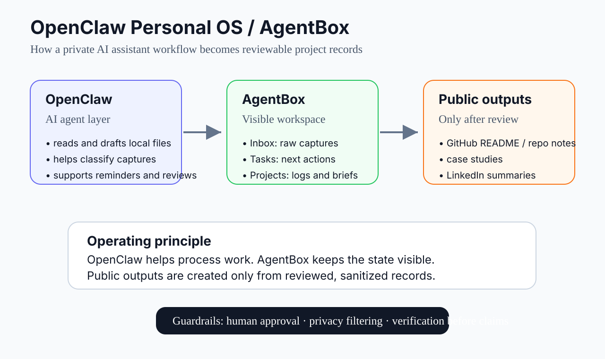
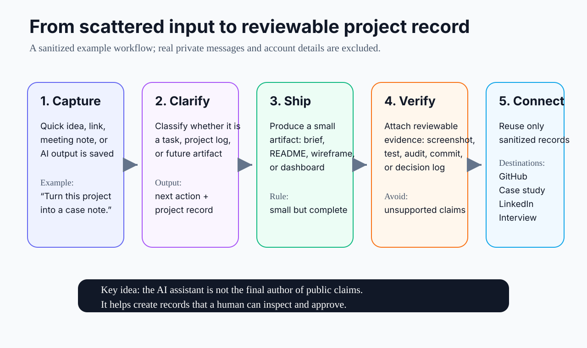

# OpenClaw Personal OS / AgentBox

> A personal AI workflow experiment for turning scattered ideas into tasks, artifacts, and reviewable project records.

## Summary

**KR**  
OpenClaw Personal OS / AgentBox는 흩어지는 아이디어, 작업, 프로젝트 기록을 `Capture → Clarify → Ship → Verify → Connect` 흐름으로 정리해, 나중에 검토 가능한 산출물과 포트폴리오 자료로 남기기 위한 개인 AI workflow 실험입니다.

**EN**  
OpenClaw Personal OS / AgentBox is a personal AI workflow experiment for turning scattered ideas, tasks, and project notes into reviewable artifacts through a `Capture → Clarify → Ship → Verify → Connect` loop.

This is not a claim that the system is fully automated or production-grade. The point is narrower: **use an AI assistant as a workflow layer that helps capture work, keep project state visible, and create public materials only after human review.**

---

## What are OpenClaw and AgentBox?

I use two names in this case study:

| Name | Meaning in this workflow | Why it matters |
|---|---|---|
| **OpenClaw** | The local AI assistant layer that helps read, draft, classify, remind, and review work. | It reduces the friction between a thought, a task, and a draft artifact. |
| **AgentBox** | A visible folder/workspace structure where captures, tasks, project logs, and outputs are stored. | It keeps the workflow inspectable instead of leaving everything inside chat history. |

In simple terms:

```text
OpenClaw = assistant that helps process the work
AgentBox = workspace that keeps the state visible
GitHub / LinkedIn / case studies = reviewed public outputs
```



---

## Problem

Ideas, tasks, and project notes appear constantly, but they often get scattered across chats, notes, browser tabs, and temporary files.

The problem is not just “not writing things down.” The bigger problem is that this chain often breaks:

```text
thought → task → artifact → verification → reviewable project record
```

Common failure modes:

- a good idea is captured but never clarified into a next action
- a project moves forward, but the reasoning and decisions are not recorded
- an AI-generated draft looks useful but disappears after one conversation
- GitHub or LinkedIn updates are written later from memory instead of from artifacts
- evidence such as screenshots, tests, decisions, and logs is reconstructed too late

So the question behind this experiment is:

> Can an AI assistant be used not just as a response tool, but as a workflow layer for capturing, clarifying, shipping, verifying, and connecting work?

---

## My Role

I worked on this as the user and workflow designer of the system.

Main responsibilities:

- identified bottlenecks in my personal project and learning workflow
- designed a simple AgentBox folder structure for captures, tasks, projects, and outputs
- defined the `Capture → Clarify → Ship → Verify → Connect` loop
- used OpenClaw to support reminders, documentation, drafting, and review
- created public-safe case study materials from internal project records
- kept public/external actions behind a human confirmation gate

The goal was not to make AI “do everything automatically.”  
The goal was to make AI-assisted work easier to inspect, verify, recover, and reuse.

---

## Workflow Design



| Step | What happens | Example record |
|---|---|---|
| **Capture** | Save raw ideas, links, tasks, questions, and meeting notes. | quick capture note |
| **Clarify** | Decide whether the item is a task, memory, project log, or future artifact. | task board / project log |
| **Ship** | Turn it into a small artifact. | README section, brief, proposal, wireframe, dashboard |
| **Verify** | Add something reviewable. | test result, screenshot, audit, commit, decision log |
| **Connect** | Reuse only reviewed records in public/career contexts. | GitHub README, case study, LinkedIn draft, interview answer |

AgentBox is intentionally simple:

```text
AgentBox
├─ 00_Control-Tower   # what to look at now
├─ Inbox              # raw captures and quick notes
├─ Tasks              # next actions and execution board
├─ Projects           # logs, briefs, strategy docs, case-study drafts
├─ outbox             # files prepared for handoff or publication
└─ archive / scratch  # parked or temporary material
```

This structure is not sophisticated by itself. Its value is that the AI assistant has a stable place to put and retrieve work, and I can inspect the result without digging through chat history.

---

## Sanitized Example Flow

The image and example below use only mock data. They do not contain real private messages, account details, schedules, channel IDs, or internal files.


Example:

```text
1. Capture
   “Turn this project note into something I can reuse later.”

2. Clarify
   OpenClaw classifies it as a project log + next action,
   not just an archive note.

3. Ship
   A short project brief, README section, or case-study draft is produced.

4. Verify
   The artifact is checked with a screenshot, test result, diff, audit,
   or direct human review.

5. Connect
   Only the sanitized version becomes a GitHub note, LinkedIn draft,
   or interview-ready project story.
```

---

## Before / After

| Before | After |
|---|---|
| Ideas scattered across chats and tabs | Captured into a visible workflow |
| Tasks relied on memory | Tasks and project logs become reviewable |
| Project records were reconstructed later | Reviewable records are collected during the work |
| AI output ended as one-off text | Outputs are inspected, revised, and saved |
| GitHub/LinkedIn updates felt separate | Work artifacts become profile-ready project records |

---

## What this case study does *not* claim

To keep the case study honest:

- this is not a production SaaS product
- this is not a benchmarked productivity study
- this does not claim that AI replaces human judgment
- this does not publish private messages, account details, schedules, or internal notes
- this does not present ongoing team projects as finished outcomes

The current value is workflow design: making the path from messy input to reviewable artifact more explicit.

---

## Guardrails

The most important part of this workflow is not automation. It is safe, reviewable operation.

Guardrails:

- public posts, LinkedIn edits, GitHub pushes/releases, comments, and DMs require final human confirmation
- private messages, account details, channel IDs, personal schedules, and sensitive notes are excluded from public materials
- ongoing projects are not presented as finished outcomes
- AI-generated artifacts should be checked through tests, screenshots, audits, diffs, or direct inspection when possible
- deletions require explicit approval

---

## What I Learned

The value of an AI-assisted workflow is less about how autonomous the AI is and more about whether the work can be reviewed, trusted, and reused.

The important questions are:

- Does the work leave a trail?
- Can I tell what changed and why?
- Is there a human approval point before external action?
- Can the result be verified?
- Can the artifact be reused later as a project record?

For my own workflow, the most useful pattern has been simple:

```text
small capture → clear next action → artifact → verification → reviewable story
```

---

## Current Status

This is an early case study, not a finished product.

Current artifacts:

- public case study note
- architecture diagram
- capture-to-case-study workflow diagram
- sanitized mock workflow image
- GitHub profile README connection
- LinkedIn-ready public summary connection

Next improvements:

- add a small public demo folder or example template
- add one concrete public-safe project example beyond the mock workflow
- use the same case-study format for ThermoShift and re:action after public-scope checks
- add before/after examples grounded in public-safe project artifacts

---

## Related Portfolio Themes

This case study supports three broader directions:

1. **Decision support systems** — turning messy information into clearer choices
2. **Human execution systems** — helping plans turn into action and feedback
3. **AI-assisted workflow** — using AI tools with logs, approval points, verification, and reviewable records
